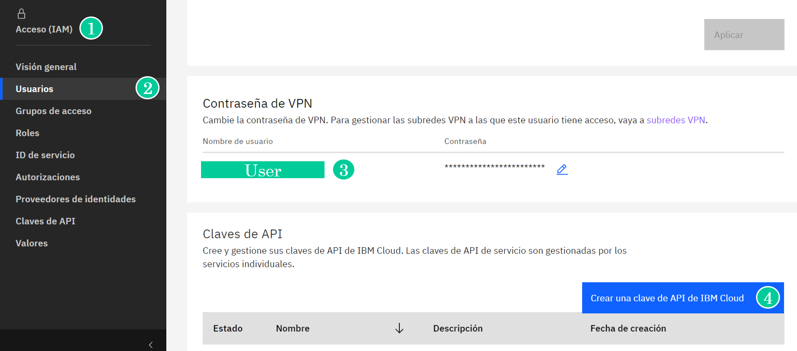
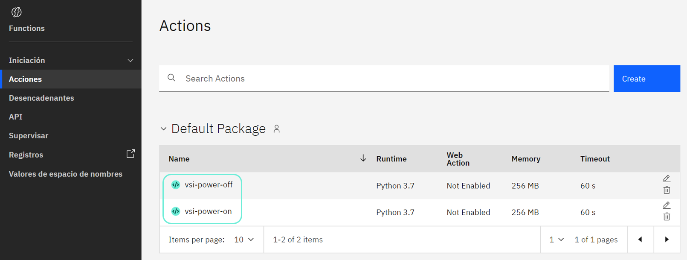
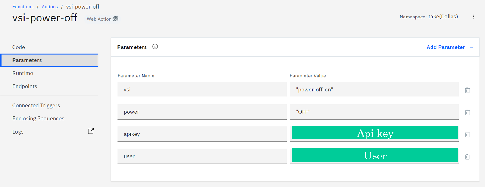
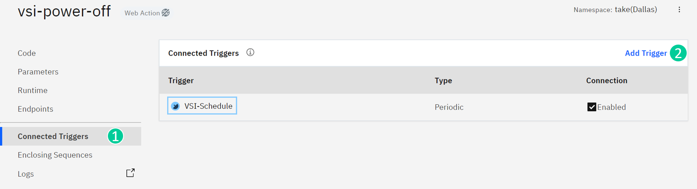

# IBM FUNCTIONS VSI ON-OFF ☁️

En esta guía encontrará el paso a paso para automatizar la tarea de encendido y apagado de una máquina virtual dentro de IBM Cloud mediante la herramienta Functions. Los pasos acá descritos fueron tomados y adaptados de la documentación presente en este [LINK](https://qiita.com/takeyan/items/da3af7eed57733ad8609).

## Prerrequisitos :pushpin:

* [Ibmcloud CLI](https://cloud.ibm.com/docs/cli?topic=cli-install-ibmcloud-cli)
* [Docker CE](https://docs.docker.com/get-docker/)
* [Functions Plugin](https://cloud.ibm.com/docs/cli?topic=cli-plug-ins)

## Creación de acciones :pushpin:

1). Inicie sesión en IBM Cloud y configure la organización, grupo de recursos y espacio de trabajo en Cloud Foundry, para esto ejecute los siguientse comandos.

```sh
 ibmcloud login --sso
 ibmcloud target -–cf
 ibmcloud target -g Default
```

2). Cree un nombre de espacios donde se ejecutará la acción y especifíquelo como destino mediante los siguientes comandos (También puede usar uno existente).

```sh
ibmcloud fn namespace create <nombre_namespace>
ibmcloud fn property set  --namespace <nombre_namespace>
```

3). Cree el archivo **requirements.txt** que contenga los paquetes necesarios, su contenido para esta guía será:

```sh
softlayer
```

4). Cree el archivo **__main__.py** que contenga la lógica de la acción a implementar, su contenido para esta guía será:

```sh
import SoftLayer

def main(dict):

    API_USERNAME = dict['user']
    API_KEY = dict['apikey']
    POWER = dict['power']
    VSI = dict['vsi']
    client = SoftLayer.create_client_from_env(username=API_USERNAME, api_key=API_KEY)

    try:
        virtualGuests = client['SoftLayer_Account'].getVirtualGuests()

    except SoftLayer.SoftLayerAPIError as e:
        print("Unable to retrieve virtual guest. "
              % (e.faultCode, e.faultString))

    vsiFound = False
    for virtualGuest in virtualGuests:
        if virtualGuest['hostname'] == VSI:
            vsiFound = True
            try:
               if POWER == 'OFF':
                    virtualMachines = client['SoftLayer_Virtual_Guest'].powerOff(id=virtualGuest['id'])
               else:
                    virtualMachines = client['SoftLayer_Virtual_Guest'].powerOn(id=virtualGuest['id'])

            except SoftLayer.SoftLayerAPIError as e:
                 vsiFound = e

    return { 'VSI' : VSI, 'Action' : POWER,  'Action_Performed' : vsiFound, 'result' : virtualMachines }
```

5). Descargue la imagen de Docker proporcionada por Functions.

```sh
docker pull ibmfunctions / action-python-v3.7
```

6). Descargue el paquete especificado en requirements.txt y colóquelo en el directorio virtualenv.

```sh
docker run --rm  -v  " $ PWD : / tmp" ibmfunctions / action-python-v3.7 bash -c  "cd / tmp && virtualenv virtualenv && source virtualenv / bin / enable && pip install -r requirements.txt"
```

7). Empaquete virtualenv y __main__.py en un archivo zip.

```sh
zip -r takeyan-vsi-classic-power.zip virtualenv __main__.py
```

8). Mediante los siguientes comandos cree dos acciones (una de encendido y otra de apagado de la VSI) e implemente el paquete (archivo zip).

```sh
ibmcloud fn action create takeyan-vsi-classic-power-on takeyan-vsi-classic-power.zip --kind python:3.7
ibmcloud fn action create takeyan-vsi-classic-power-off takeyan-vsi-classic-power.zip --kind python:3.7
```

## Creación clave API :pushpin:

Para permitir que una acción de Functions modifique el estado de su infraestructura siga estos pasos:

1). En la página de IBM Cloud ingrese en la sección **Gestionar -> Acceso (IAM)**.

2). En la pestaña **Usuarios** seleccione su correspondiente usuario.

3). De la sección **Contraseña de VPN** copie el valor de nombre de usuario.

4). De click en la opción **Crear una clave de API de IBM Cloud** y copie el valor generado, recuerde que solo podrá ver este valor una vez.

 

## Establecer parámetros :pushpin:

Se establecerán 4 parámetros para ejecutar las acciones:

* vsi: Nombre VSI del destino de la operación
* power: on / off
* apikey: Clave de API del paso anterior
* usuario: Usuario del paso anterior

Para hacerlo siga estos pasos:

1. Ingrese en el menú de tres líneas y en él seleccione la opción **Functions -> Acciones**. En esta opción encontrará las dos acciones creadas anteriormente.

 

2. Ingrese en la acción de apagado y en la estaña **Parameters** e ingrese los siguientes valores:

 

3. Siga los mismos pasos anteriores para la acción de encendido.

## Creación del disparador :pushpin:

Para que estas acciones se ejecuten de forma periódica relaciónelas a un disparador o trigger, para hacerlo siga estos pasos:

1. Ingrese a la pestaña **Connected triggers**.
2. De click en **Add trigger** y seleccione la opción **Periodic**.
3. Proporcione un nombre, seleccione las opciones que se adapten a su organización y guarde los cambios.

 

4. Siga los pasos anteriores para crear un nuevo trigger dentro de su acción on.

Puede probar su ccorrecto funcionamiento al establecer el trigger a una hora cercana y verificar que su instancia cambie de estado.

## Referencias :pushpin:

La información acá descrita está basada en el contenido de la publicación : https://qiita.com/takeyan/items/da3af7eed57733ad8609

## Autores ✒️
IBM Cloud Tech Sales
